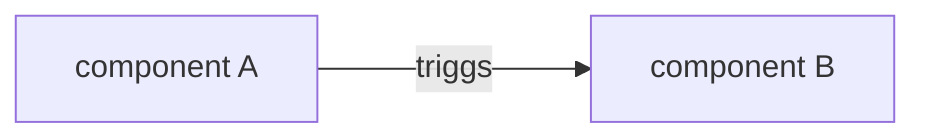
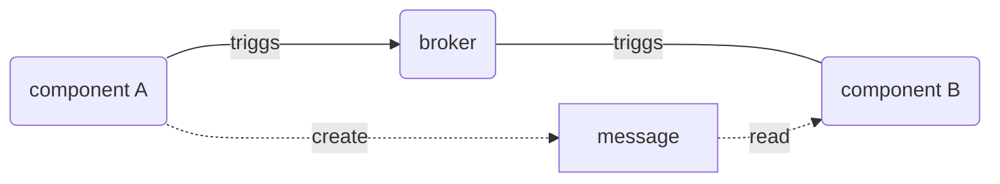
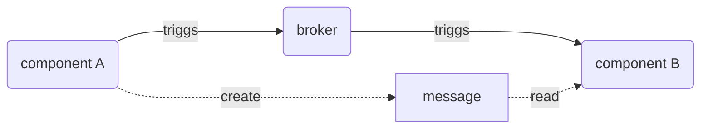

# Architecture patterns
## Architecture cycle/phases

# Architecture styles

> TODO: [cell-based Architecture](https://github.com/wso2/reference-architecture/blob/master/reference-architecture-cell-based.md) (cellular architecture)

## Architecture style: Microservice
### Microservices Benefits:
* Independent Deployments
* Fault Isolation
* Enchanced Scalability
### Microservices importance of design patterns:
* Scalability
* Reducing Complexity
* Distributed Data Management
* Enhancing Communication
### Microservices Design patterns:
* API Gateway
  > like GoF.facade
  > single entry point for all client requests
* Database per Service
  > like a GoF.memento ( partially )
  > single databank per service, data isolation
* Circuit Breaker
  > prevent overwhelming of the calls to outdated external resource
* Event-Driven
  > like GoF.observer
  > publish event ( notify ), when own state has changed
* Saga
  > like a GoF.command + GoF.proxy
  > for list of the external call will make undo in case of fail

# Communication between applications
## File System 

## Shared DB

## RMI

### REST 
> can be considered as a RemoteMethodInvocation

* both of the services must be online
* for scaling need to add additional layer ( facade/InformationExpert )

## messaging
### Kafka
**Model:** Publisher(1) --> Subscriber(*)  
"Component B" must ask by himself the Broker

[local start is cumbersome](https://github.com/cherkavi/docker-images/tree/master/kafka/)

### JMS ( or even ReDis stream)
**Model:** Producer(1) --> Consumer(+)

## [Antipatterns](https://sourcemaking.com/antipatterns/software-architecture-antipatterns)

