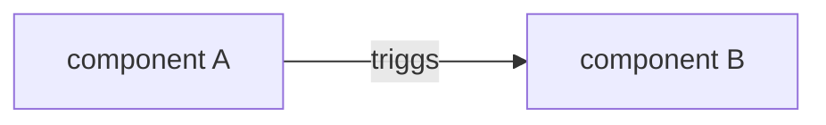
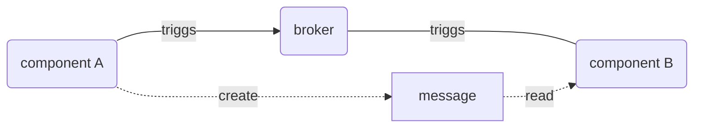
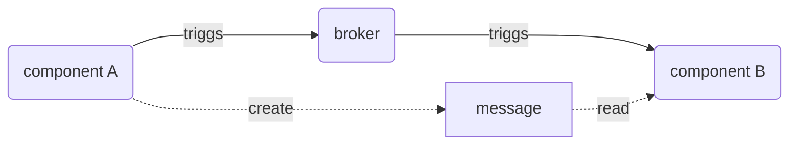

# Architecture patterns
* Patterns of Enterprise Application Architecture ( Martin Fowler )
* Software Architecture Patterns ( Mark Richards )
* Enterprise Integration Patterns ( Gregor Hohpe )

# [Antipatterns](https://sourcemaking.com/antipatterns/software-architecture-antipatterns)

# Architecture phases

# Architecture styles
* 
> :TODO: [cell-based Architecture](https://github.com/wso2/reference-architecture/blob/master/reference-architecture-cell-based.md) (cellular architecture)
* [data mesh](./data-mesh.md)

## Architecture style: Microservice
### Microservices Benefits:
* Independent Deployments
* Fault Isolation
* Enchanced Scalability
### Microservices importance of design patterns:
* Scalability
* Reducing Complexity
* Distributed Data Management
* Enhancing Communication
### Microservices Design patterns:
* API Gateway
  > like GoF.facade
  > single entry point for all client requests
* Database per Service
  > like a GoF.memento ( partially )
  > single databank per service, data isolation
* Circuit Breaker
  > prevent overwhelming of the calls to outdated external resource
* Event-Driven
  > like GoF.observer
  > publish event ( notify ), when own state has changed
* Saga
  > like a GoF.command + GoF.proxy
  > for list of the external call will make undo in case of fail

## Model Driven Architectre

### RM-ODP - Reference Model for Open Distributed Processing
It is an international standard used to design large-scale, distributed systems (systems running on multiple computers or servers across networks).  
RM-ODP divides a system into **5 distinct Viewpoints**. Instead of looking at the whole chaotic system at once, you look at it through five different "lenses":  

| Viewpoint         | What it Focuses On                                                     | The Core Question                                                     |
| ---               | ---                                                                    | ---                                                                   |
| **Enterprise**    | Business goals, budget, scope, and organizational policies.            | *Why* are we building this, and what business rules apply?            |
| **Information**   | The data structure, semantics, and information flow.                   | What information does the system need to store and process?           |
| **Computational** | Functional breakdown and how separate components interact.             | What do the individual software blocks actually do?                   |
| **Engineering**   | The underlying infrastructure, communication channels, and deployment. | How do we physically move data between servers reliably and securely? |
| **Technology**    | The specific hardware, software, and tech stack choices.               | Are we using AWS or Azure? Python or Java? Linux or Windows?          |

# Communication between applications
## File System 

## Shared DB

## RMI - remote method invocation

### REST 
> can be considered as a RemoteMethodInvocation

```mermaid
flowchart LR

a[component A] --->|triggs| b[component B]
```
* both of the services must be online
* for scaling need to add additional layer ( facade/InformationExpert )

## messaging
### Kafka
**Model:** Publisher(1) --> Subscriber(*)  
"Component B" must ask by himself the Broker

```mermaid
flowchart LR

a(component A) --->|triggs| br(broker)

br <---|triggs| b(component B) 

m[message]
a -.->|create| m  -.->|read| b
```

[local start is cumbersome](https://github.com/cherkavi/docker-images/tree/master/kafka/)

### JMS ( or even ReDis stream)
**Model:** Producer(1) --> Consumer(+)

```mermaid
flowchart LR

a(component A) --->|triggs| br(broker)

br --->|triggs| b(component B) 

m[message]
a -.->|create| m  -.->|read| b
```
