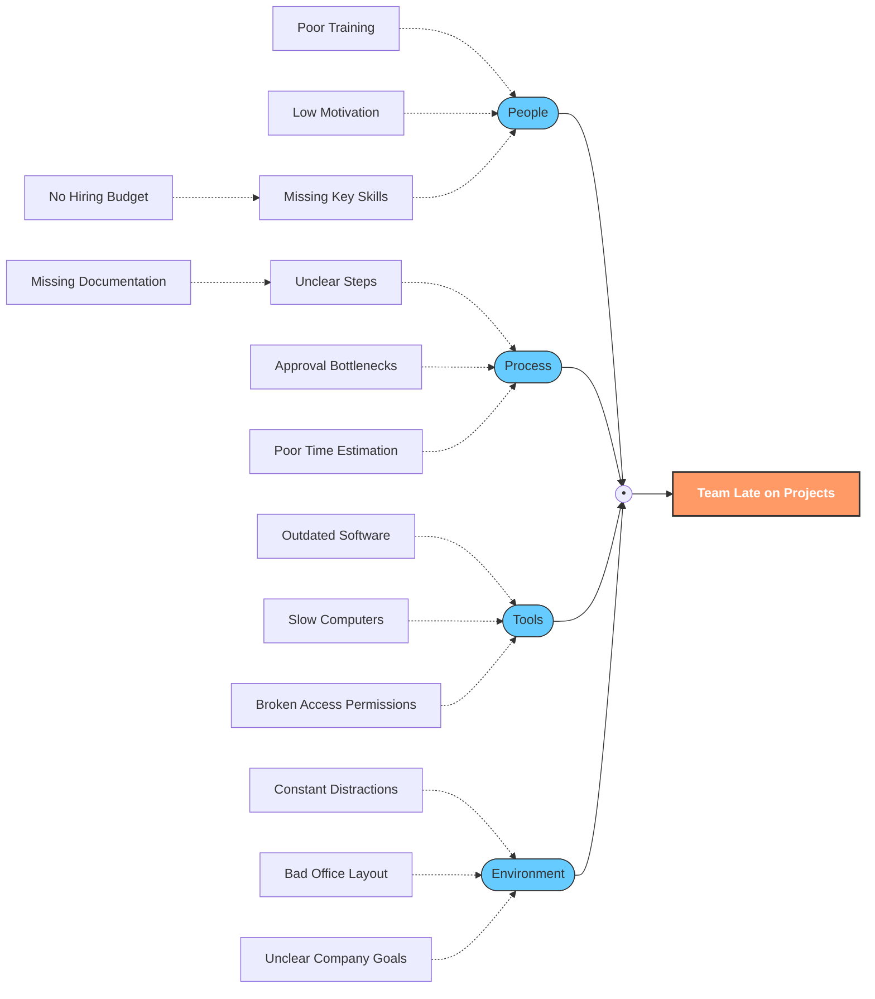

# Creativity

## The "Why" Technique & Perspective Shifting

### 🔍 Phase 1: Zooming Out with the "Why" Technique

When confronted with a challenge, do not just look at the surface. Force yourself to explore the problem deeply from the affected person's point of view by repeatedly asking **"Why?"**. Each **Why?** question should be asked for result of previous answer.
This process helps you "zoom out" to see the bigger picture and uncover root causes. 

### 🚀 Phase 2: Next-Level Creativity (The Perspective Shift)

True creativity begins when you stop looking at a problem from just one fixed position. To unlock new ideas, you must systematically shift your vantage point by digging deeper into the problem and looking at it through different eyes.

Once you have exhausted your own point of view, elevate your creative thinking to the next level by completely abandoning your personal perspective.

**Core Action:**
* **Ask questions from the point of view of another person.**
* *Examples of alternative perspectives to adopt:*
* **The Complete Outsider:** How would someone from a completely different industry or culture solve this?
* **The Skeptic/Competitor:** How would someone trying to beat you or disprove you look at this situation?
* **The Child:** What simple, obvious questions would a child ask that adults normally overlook?

Here is a simple, easy-to-understand description of the Ishikawa technique, also known as the Fishbone Diagram.

## The Fishbone Trick: Unlocking Creativity by Finding Root Causes
#brainstorming, #creativity

The Ishikawa technique is a creative way to team up and think through all the possible reasons *why* a problem is happening. Because the final drawing looks like a fish skeleton, we call it a **Fishbone Diagram**:
* It stops you from just guessing. 
* It forces your brain to look at a problem from **many different angles** systematically
* This brings structure to brainstorimng
* helps you discover creative connections you might have missed

### How to Do It: Easy Steps

Imagine you want to solve a problem, like: **"Our team is always late on projects."**

### Step 1: The Head (The Problem)

Draw a box on the right side of a big sheet of paper. Write your problem inside it. This is the **head of the fish**. Draw a long horizontal line coming out of it. This is the **spine**.

### Step 2: The Big Bones (The Categories)

Think of the main "buckets" where problems usually come from. Draw angled lines branching off the spine. These are the **big bones**.

Classic buckets are:

* **People:** Who is involved? (skills, training, motivation)
* **Process:** How do we do it? (steps, rules, methods)
* **Tools:** What do we use? (software, machines, equipment)
* **Environment:** Where does it happen? (office, noise, culture)

### Step 3: The Small Bones (The Causes)

Now, brainstorm together. For *each* big bucket, ask: **"Why might this bucket be causing the problem?"**

Draw smaller lines coming off the big bones. If someone says "Poor communication," draw that as a small bone off the **People** bone.

### Step 4: Keep Asking "Why?"

For every small bone, keep asking **"Why does *that* happen?"** and draw even smaller bones. This helps you get to the true **root cause**.

> *Poor communication* $\xrightarrow{Why?}$ *No weekly meeting* $\xrightarrow{Why?}$ *We think we are too busy.*

## **Mind Mapping** (the central problem + branching aspects) and **SCAMPER** (the verb-replacement/manipulation step)
Our brains get stuck in "grooves" — we describe a problem the same way every time, so we keep thinking of the same solutions. By forcing yourself to **change the verbs**, you're essentially changing *what kind of problem* you're looking at, which leads to solutions you'd never have found otherwise.

### In Short:

| Step | What You Do | Tool Name |
|---|---|---|
| 1 | Draw the problem in the center, branches for each aspect | **Mind Map** |
| 2 | Replace verbs in each branch to reframe the problem | **SCAMPER / Verb Substitution** |

### 🗺️ Step 1: Mind Mapping — "Draw the Problem Like a Spider"
Mind mapping, also known as spider diagrams, is a creative problem-solving technique for creating a visual representation of your ideas

**How to do it:**
1. Write your **problem or task** in the middle of a page — put a circle around it.
2. Draw lines outward from the center, like spider legs.
3. At the end of each line, write a **factor, aspect, or description** of your problem.

**Example:**
* "Our team keeps missing deadlines"*  
  * "People don't know their tasks" 
  * "Tasks take longer than expected" 
  * "Team doesn't communicate enough" 
  * "Manager approves things too slowly"*

With this technique, you place the problem in the center and create branches that represent possible causes, effects, or solutions. This allows you to explore various aspects of the problem visually and logically.

### 🔄 Step 2: Replace the Verbs — The SCAMPER Twist
Once your map is drawn, you look at the **verbs** (action words) in each branch description and **swap them out** for different verbs. This forces your brain to see the problem from a completely new angle.

**Example:**
* "Our team keeps missing deadlines"*  
  * "People don't **know** their tasks" 
  * "Tasks **take** longer than expected" 
  * "Team doesn't **communicate** enough" 
  * "Manager **approves** things too slowly"*

This idea comes from **SCAMPER** — a creativity method that uses action verbs to shake up your thinking. SCAMPER works by providing a list of active verbs that are associated with a problem to create ideas. As verbs, they are about doing, and as such, help students to transform thinking into action.

The verb-swapping trick also connects to a simpler reframing idea: changing the verbs into nouns and nouns into verbs can completely shift what a problem suggests. For example, "How to sell more bottles?" becomes "How to bottle more sales?" — now suggesting closing sales rather than increasing sales volume.

**How it works:**

* "Our team keeps missing deadlines"*  
  * "People don't **know** their tasks" 
    * "know" → assign / receive / remember / track — each suggests a different fix
  * "Tasks **take** longer than expected" 
  * "Team doesn't **communicate** enough" 
  * "Manager **approves** things too slowly"*
    * "approves" → delegates / blocks / receives / reviews — suddenly the manager's role looks very different

Now replace "approves" with other verbs:
- *Manager **delegates** things too slowly* → Maybe the manager shouldn't be the approver at all?
- *Manager **blocks** things too slowly* → Reframes the manager as an obstacle
- *Manager **receives** things too slowly* → Maybe the team is late to even submit things?

Each new verb opens a **completely different door** in your thinking.
