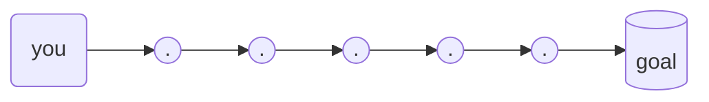
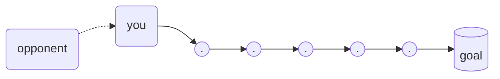
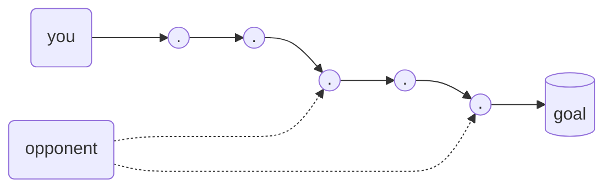
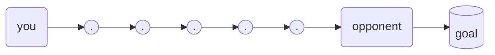

# Negotiations
1. collect information about your [opponent](#opponent)
2. prepare for negotiations with [negotiation map](#negotiation-map)
3. during the negotiations [make notes](#making-notes) and write your thoughts
4. make a "retrospective" afterwards

## Opponent 
### You can speak with:
1. Organization ( no persons, just business roles )
2. Group of people ( 2+ )
3. Single person ( at the end )
   > In most cases it will be one-to-one conversation ( even with couple of people each of them will be responsible for separate area ).

### **What you want to achieve**
between you and your goal there are 1+ steps

**and role of your opponent can be:**  
1. beginning: opponent should play role before you are going to start you journey

2. middle: opponent should play role in one/many step(s)


3. end: opponent is controlling access to the goal


## Negotiation map

### Advices
#### Explanation cards
For each point create paper-card with 1-2 sentences.
Each "explanation card" should have 1-3 icons/tags to show the emotions like:
1. smile
2. past, now, future
3. work/job out-of-work
4. link
5. idea (bulb)
6. goal
7. dangerous
8. resources
9. capability 


#### Opponent's concerns and risks 
prepare story(ies) about each of them 


### map with focusing on the opponent 
```
                          Subject/Goal of negotiations
                  current situation ----->  desired situation 
                                            * min
                                            * max 
                                            * super-maximum
              
              couple of options/alternatives how to achieve goal
       ( each alternative should be comparable and measurable with other ) 
                         

------------------------------------------------------------------------------
|                                                     |     Opponent's       |
|                Demands to the "opponent"            |      Emotional       |
|                 What ? How to measure ?             |     Distinctives     |
|                                                     |                      |
|                                                     |                      |
|                                                     |                      |
|                                                     |                      |
------------------------------------------------------------------------------
|                                     |                                      |
| ("opponent's") interests and values | ("opponent's") concerns and risks    |
|     any shared interests/values     |     any shared concerns/risks        |
|                                     |                                      |
|                                     |                                      |
|                                     |                                      |
|                                     |                                      |
|                                     |                                      |
------------------------------------------------------------------------------
```

### full map with reflection to yourself
```
------------------------------------------------------------------------------
|                                     |                                      |
|    ("my") interests and values      |     ("my") concerns and risks        |
|                                     |                                      |
|                                     |                                      |
|                                     |                                      |
|                                     |                                      |
|                                     |                                      |
|                                     |                                      |
------------------------------------------------------------------------------
|                                                     |     Opponent's       |
|                Demands to the "opponent"            |      Emotional       |
|                 What ? How to measure ?             |     Distinctives     |
|                                                     |                      |
|                                                     |                      |
|                                                     |                      |
|                                                     |                      |
------------------------------------------------------------------------------
                                
                          Subject/Goal of negotiations
                  current situation ----->  desired situation 
                                            * min
                                            * max 
                                            * super-maximum
              
              couple of options/alternatives how to achieve goal
       ( each alternative should be comparable and measurable with other ) 
                         

------------------------------------------------------------------------------
|                                                     |     Opponent's       |
|                Demands to the "opponent"            |      Emotional       |
|                 What ? How to measure ?             |     Distinctives     |
|                                                     |                      |
|                                                     |                      |
|                                                     |                      |
|                                                     |                      |
------------------------------------------------------------------------------
|                                     |                                      |
| ("opponent's") interests and values | ("opponent's") concerns and risks    |
|                                     |                                      |
|                                     |                                      |
|                                     |                                      |
|                                     |                                      |
|                                     |                                      |
------------------------------------------------------------------------------
```

## making notes
```
------------------------------------------------------------------------------
|                                                     |                      |
|                                                     |     Your emotion     |
|                    Discussed point                  |     Action point     |
|                 Who ? What ?                        |     Icon/tag  it     |
|                              Is this for you ?      |                      |
|                                                     |                      |
------------------------------------------------------------------------------
```