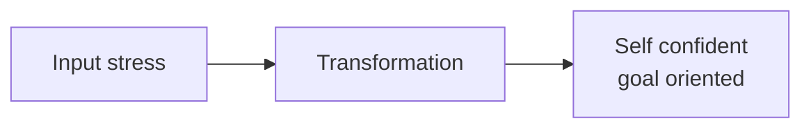

# Stress resilience
for your internal peace you must rely on yourself   
( not on someone )  

## Perception of events
**you should see only positive sides**
|  what you feel      |  transformed to |
|---------------------|-----------------|
|     ~~stress~~      |   challenge,    |
| ~~rage/fury/anger~~ |   opportunity for growth  |
|   ~~sadness~~       |                 |

## Discomfort
small difficulties and obstacles should be a norm of your day-life
* the preparation of yourself for a big jump
* self control
* when you have difficulties - you are growing

## Thankfulness
> it is source of the energy for you
* ~2-3 min of thankfulness per day
* find positive
* remember about death
* to remove negative emotions
* to feel fertility

## Changes
* new ways for your growing
* flexibility of your mind
* awarness - you are changer of your future ( NOW )
* flexible expectation of the future ( your plans will be changed )

## Your perception/opinion != Fact
* analyse your feeling/reactions outside of your body/mind
* change negative feeling to "dry facts" only (without your emotions)
  > cognitive restructuration 
* self control - clear vision during the difficulties

## self-discipline
* habits
* responsibilities for the actions
* reflection:
  * what is for me
  * what to avoid 
* put aside your ad-hoc/immediate desire(s)

## education - every day

## course of actions
* wisdom
* courage
* abstension
* admit and correct mistakes

## detachment
* break link with stress - rid it off, distancing
* inevitability of losses
* less material attachments
* independence from others ( emotionally ), pillar inside yourself
* focus on the process, not the result